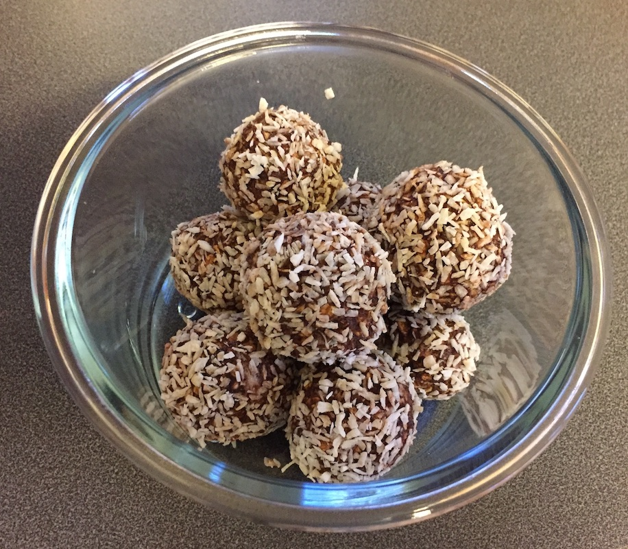

# Chocolate Balls
Chocolate ball are Swedish treats that are super easy to make.

## Ingredients
| Makes approximately 16 balls |  |
|:-------------------|----------------:|
| Butter (room temperature) | 150 g |
| Sugar | 150 ml |
| Rolled oats | 400 ml |
| Cocoa powder | 4 tablespoons (60 ml) |
| Vanilla sugar | 1 teaspoon (5 ml) |
| Coffee | 2 tablespoons (30 ml) |
| --- | --- |
| Coco flakes or sprinkles | *To roll the balls in* |

## Instructions
- Mix all ingredients thoroughly
- Form into small balls and roll in the coco flakes / sprinkles
- Leave in the fridge to cool down and harden
- Enjoy!

[{style="width:75%"}](chocolate-balls.jpg)
