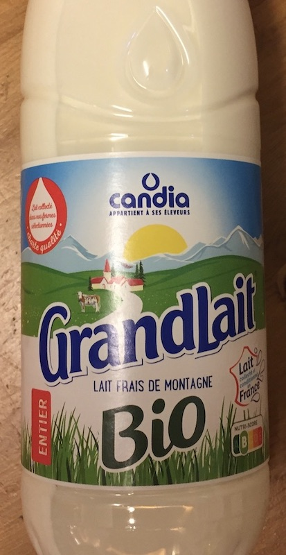
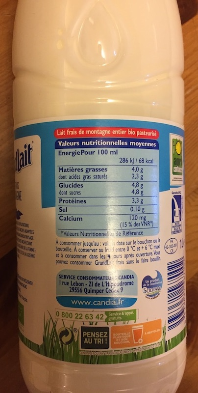
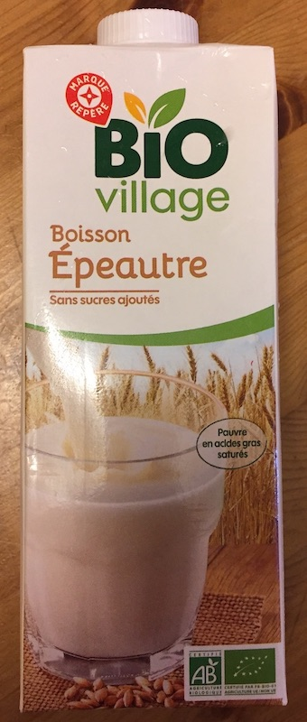
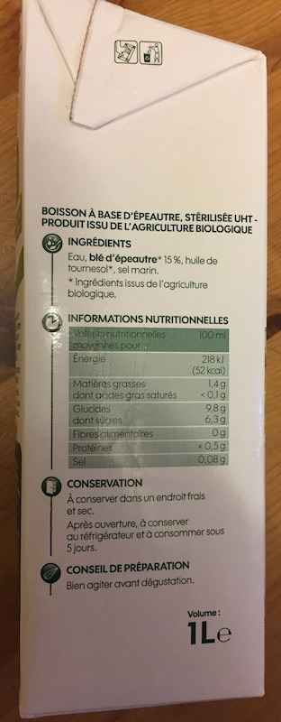

# Milk Alternatives
This is just a small experiment to test what's out there to buy at the moment.
The rating is based on how similar it tastes to regular cow milk.

<!-- ----------------------------------------------------------------------- -->
---
## Regular Cow Milk
- Rating: ⭐️⭐️⭐️⭐️⭐️ (baseline)

| Front | Nutrition facts |
|:-------------------:|:----------------:|
| [{style="width:40%"}](milk_front.jpg) | [{style="width:40%"}](milk_nutrition.jpg) |

### Nutrition facts
| Value per | 100 ml |
|:-------------------|----------------:|
| Energy | 286 kJ (68 kcal) |
| Total fat Saturated fat | 4.0 g 2.3 g |
| Total Carbohydrates Sugar | 4.8 g 4.8 g |
| Fiber | - |
| Protein | 3.3 g |
| Salt | 0.1 g |
| Calcium | 120 mg |

<!-- ----------------------------------------------------------------------- -->
---
## Spelt
- Rating: ⭐️⭐️⭐️⭐️
- Product tested: *Bio village - Boisson Épeautre, sans sucres ajoutés*
    - -> Spelt drink without added sugar

| Front | Nutrition facts |
|:-------------------:|:----------------:|
| [{style="width:40%"}](spelt_front.jpg) | [{style="width:40%"}](spelt_nutrition.jpg) |

### Ingredients
- Water, spelt flour (15%), sunflower oil, salt

### Nutrition facts
| Value per | 100 ml |
|:-------------------|----------------:|
| Energy | 218 kJ (52 kcal) |
| Total fat Saturated fat | 1.4 g < 0.1 g |
| Total Carbohydrates Sugar | 9.8 g 6.3 g |
| Fiber | 0 g |
| Protein | < 0.5 g |
| Salt | 0.08 g |
| Calcium | - |