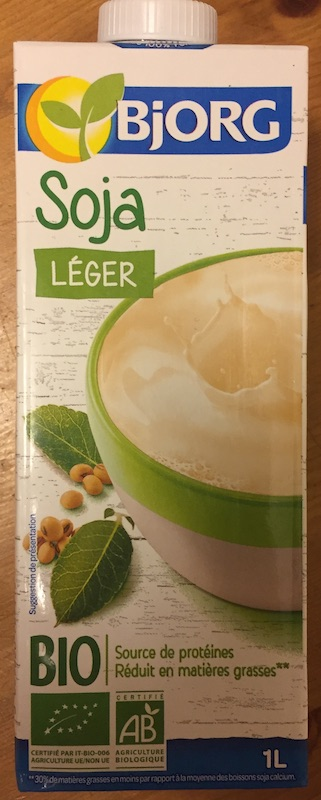
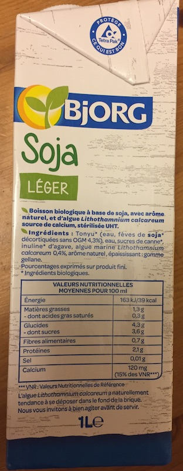
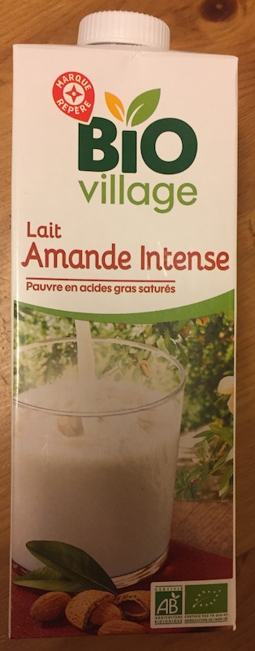
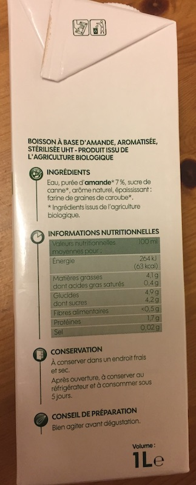
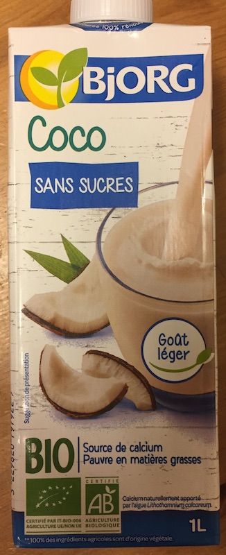
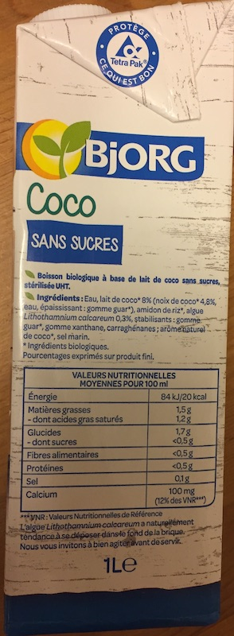

# Milk Alternatives
This is just a small experiment to test what's out there to buy at the moment.
The rating is based on how similar it tastes to regular cow milk.

<!-- ----------------------------------------------------------------------- -->
---
## Regular Cow Milk
- Rating: ⭐️⭐️⭐️⭐️⭐️ (baseline)

| Front | Nutrition facts |
|:-------------------:|:----------------:|
| [{style="width:40%"}](milk_front.jpg) | [{style="width:40%"}](milk_nutrition.jpg) |

### Nutrition facts
| Value per | 100 ml |
|:-------------------|----------------:|
| Energy | 286 kJ (68 kcal) |
| Total fat Saturated fat | 4.0 g 2.3 g |
| Total Carbohydrates Sugar | 4.8 g 4.8 g |
| Fiber | - |
| Protein | 3.3 g |
| Salt | 0.1 g |
| Calcium | 120 mg |

<!-- ----------------------------------------------------------------------- -->
---
## Soy
- Rating: ⭐️⭐️⭐️⭐️
- Product tested: *Bjorg - Soja Léger*
    - -> Light Soy
- Verdict:
    - Good level of sweetness
    - Not too strong soy flavor (which I personally don't enjoy)
    - Nutritionally similar to milk (light version)

| Front | Nutrition facts |
|:-------------------:|:----------------:|
| [{style="width:40%"}](soy_front.jpg) | [{style="width:40%"}](soy_nutrition.jpg) |

### Ingredients
- Tonyu (water, shelled soy beans without GMO 4.3%), water, cane sugar, agave inulin, lithothamnium calcareum seaweed 0.4%, natural flavor, thickener: gellan gum

### Nutrition facts
| Value per | 100 ml |
|:-------------------|----------------:|
| Energy | 163 kJ (39 kcal) |
| Total fat Saturated fat | 1.3 g < 0.3 g |
| Total Carbohydrates Sugar | 4.3 g 3.6 g |
| Fiber | 0.7 g |
| Protein | 2.1 g |
| Salt | 0.01 g |
| Calcium | 120 mg |

<!-- ----------------------------------------------------------------------- -->
---
## Spelt
- Rating: ⭐️⭐️⭐️
- Product tested: *Bio village - Boisson Épeautre, sans sucres ajoutés*
    - -> Spelt drink without added sugar
- Verdict:
    - Good flavor, has some creaminess to it
    - A bit too sweet
    - Low in nutrion, mostly carbohydrates

| Front | Nutrition facts |
|:-------------------:|:----------------:|
| [{style="width:40%"}](spelt_front.jpg) | [{style="width:40%"}](spelt_nutrition.jpg) |

### Ingredients
- Water, spelt flour 15%, sunflower oil, salt

### Nutrition facts
| Value per | 100 ml |
|:-------------------|----------------:|
| Energy | 218 kJ (52 kcal) |
| Total fat Saturated fat | 1.4 g < 0.1 g |
| Total Carbohydrates Sugar | 9.8 g 6.3 g |
| Fiber | 0 g |
| Protein | < 0.5 g |
| Salt | 0.08 g |
| Calcium | - |

<!-- ----------------------------------------------------------------------- -->
---
## Almond (intense)
- Rating: ⭐️⭐️⭐️
- Product tested: *Bio village - Lait Amande Intense*
    - -> Intense Almond Milk
- Verdict:
    - Strong almond flavor (probably due to "intense")
    - No creaminess
    - Nutritionally similar to regular milk (except for lack of calcium)

| Front | Nutrition facts |
|:-------------------:|:----------------:|
| [{style="width:40%"}](almond_front.jpg) | [{style="width:40%"}](almond_nutrition.jpg) |

### Ingredients
- Water, almond puree 7%, cane sugar, natural flavor, thickener: carob seed flour

### Nutrition facts
| Value per | 100 ml |
|:-------------------|----------------:|
| Energy | 264 kJ (63 kcal) |
| Total fat Saturated fat | 4.1 g < 0.4 g |
| Total Carbohydrates Sugar | 4.9 g 4.2 g |
| Fiber | <0.5 g |
| Protein | 1.7 g |
| Salt | 0.02 g |
| Calcium | - |

<!-- ----------------------------------------------------------------------- -->
---
## Coconut (without added sugar)
- Rating: ⭐️
- Product tested: *Bjorg - Coco - Sans Sucres*
    - -> Coconut without sugar
- Verdict:
    - Weak flavor
    - No creaminess
    - A lot of additives
    - Low in nutrition

| Front | Nutrition facts |
|:-------------------:|:----------------:|
| [{style="width:40%"}](coconut_front.jpg) | [{style="width:40%"}](coconut_nutrion.jpg) |

### Ingredients
- Water, coconut milk 8% (coconut 4.8%, water, thickener: guar gum), rice starch, Algae Lithothamnium calcareum 0.3%, stabilizers: guar gum, xanthan gum, carrageenans; natural coconut flavor, sea salt

### Nutrition facts
| Value per | 100 ml |
|:-------------------|----------------:|
| Energy | 84 kJ (20 kcal) |
| Total fat Saturated fat | 1.5 g < 1.2 g |
| Total Carbohydrates Sugar | 1.7 g <0.5 g |
| Fiber | <0.5 g |
| Protein | <0.5 g |
| Salt | 0.1 g |
| Calcium | 100 mg |

