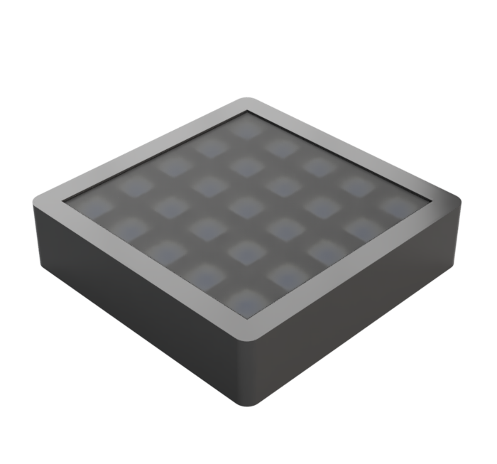
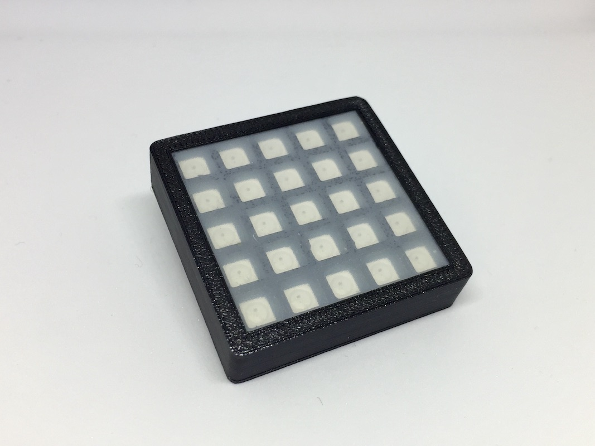
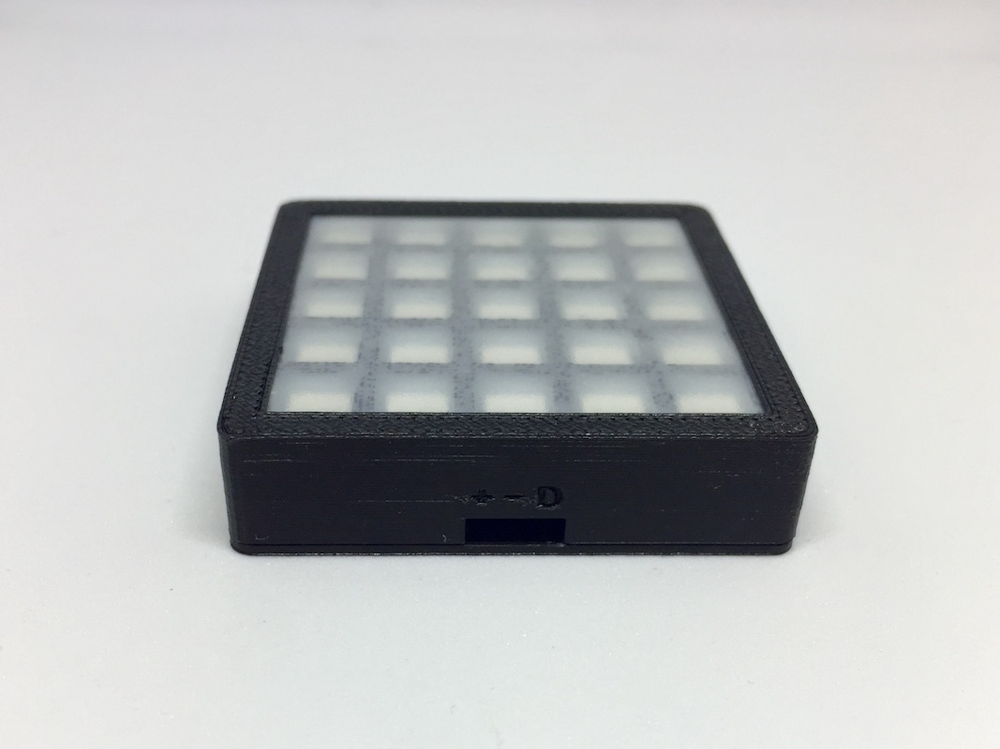

# 5x5 LED Matrix
A 5x5 LED matrix module from AliExpress with 25 WS2812B addressable LEDs.

## Case
- The case is designed in Autodesk Fusion 360 as a 3D printed snap case with a divider that separates the pixels and with space for a diffuser sheet
- The diffuser is a window foil commonly used to as a privacy screen on windows. The one I use is from "D-C-Fix" no. 16 (Part no. 346-0338)
- STL files:
    - [Top case](top_case.stl)
    - [Bottom case](bottom_case.stl)
    - [Divider](divider.stl)
[{style="width:50%"}](case-render.png)

## Assembly
| Assembly Front | Connector Side |
|:-------------------:|:----------------:|
| [{style="width:75%"}](assembly-front.jpg) | [{style="width:75%"}](assembly-side.jpg) |

<video style="width:50%" controls>
  <source src="assembly.mp4" type="video/mp4">
Your browser does not support the video tag.
</video>

