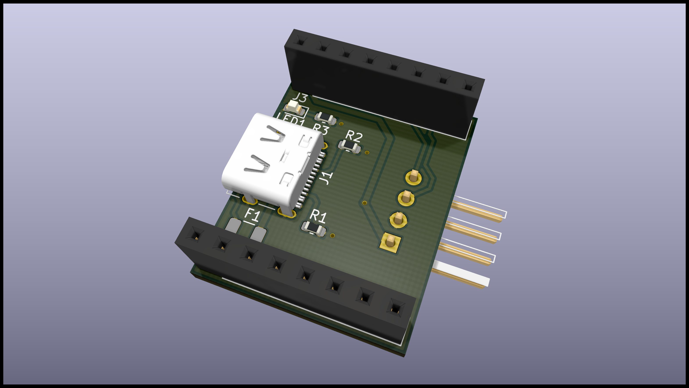
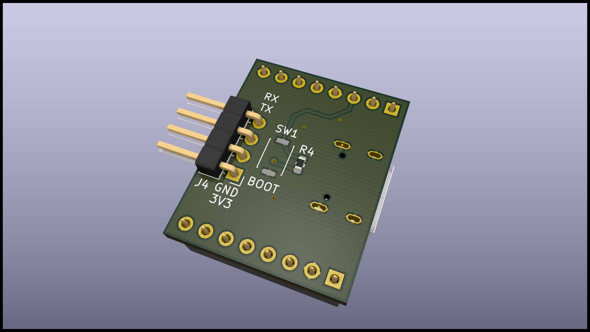

# esp32-cam-power-board
This is a board to provide power to a commonly available ESP32 camera board (ESP32-CAM) through a USB-C connector.
A UART header and boot button is available for initial programming.
It was designed in KiCad version 5.1.7 on macOS 10.15 Catalina and the full project is available on the GitHub repository.

- [GitHub repository <i class="fa fa-external-link"></i>](https://github.com/hampussandberg/esp-boards/tree/master/esp32-cam-power-board)
- [Interactive BOM](esp32-cam-power-board-ibom.html){target="\_blank"}, created using [InteractiveHtmlBom <i class="fa fa-external-link"></i>](https://github.com/openscopeproject/InteractiveHtmlBom)

[{style="width:100%"}](3d-top.png)
[{style="width:100%"}](3d-bottom.png)
