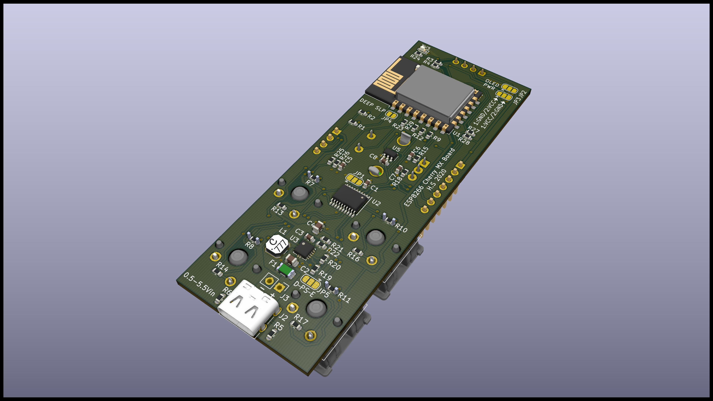
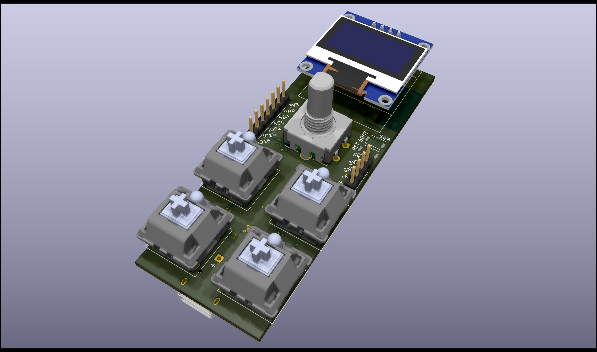

# ESP8266-Cherry-MX-Board
This is a board with switches and a display designed to interface [Home Assistant <i class="fa fa-external-link"></i>](https://www.home-assistant.io). through [ESPHome <i class="fa fa-external-link"></i>](https://esphome.io).
It was designed in KiCad version 5.1.5 on macOS 10.15 Catalina and the full project is available on the GitHub repository.

- [GitHub repository <i class="fa fa-external-link"></i>](https://github.com/hampussandberg/esp-boards/tree/master/ESP8266-Cherry-MX-Board)
- [Interactive BOM](ESP8266-Cherry-MX-Board-ibom.html){target="\_blank"}, created using [InteractiveHtmlBom <i class="fa fa-external-link"></i>](https://github.com/openscopeproject/InteractiveHtmlBom)

[{style="width:100%"}](3d-top.png)
[{style="width:100%"}](3d-bottom.png)

## Requirements
- ESPHome compatible
- 4x Cherry MX keys
- 1x Rotary encoder with switch
- OLED display
- Low input voltage power power converter (TPS61200)
- Serial header with boot button for initial programming, over-the-air (OTA) after
- I2C header with any remaining pins for connection of additional sensors [optional]
- USB-C connector for 5 V power [optional]

## Main components used
- [ESP-12F <i class="fa fa-external-link"></i>](https://en.wikipedia.org/wiki/ESP8266) module with ESP8266 chip
- [TPS61200 <i class="fa fa-external-link"></i>](http://www.ti.com/product/TPS61200), low input voltage boost converter

## ESPHome firmware
TODO
