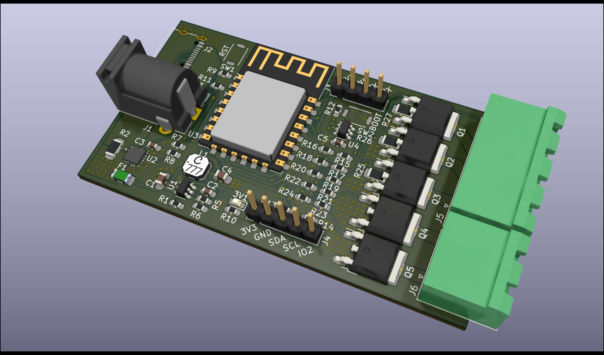

# ESP8266-LED-Controller-Board
This is a small board to control LED strips through [ESPHome <i class="fa fa-external-link"></i>](https://esphome.io).
It can support either normal RGB LED strips, with optional warm white (WW) and/or cold white (CW) LEDs, as well as smart addressable LED strips.
It was designed in KiCad version 5.1.5 on macOS 10.15 Catalina and the full project is available on the GitHub repository.

- [GitHub repository <i class="fa fa-external-link"></i>](https://github.com/hampussandberg/esp-boards/tree/master/ESP8266-LED-Controller-Board)
- [Interactive BOM](ESP8266-LED-Controller-Board-ibom.html){target="\_blank"}, created using [InteractiveHtmlBom <i class="fa fa-external-link"></i>](https://github.com/openscopeproject/InteractiveHtmlBom)

[{style="width:100%"}](3d-top.png)

## Requirements
- ESPHome compatible
- Control of 12 V RGB LED strip, with optional WW and/or CW LEDs
- Control of 5 V "smart" LED strips (WS2812, APA102, SK6812, etc)
- Measurement of LED current [optional]
- Pluggable screw terminal connections for LED strip(s)
- Serial header with boot button for initial programming, over-the-air (OTA) after
- I2C header with any remaining pins for connection of additional sensors [optional]
- USB-C connector for 5 V power [optional]
- 2.1 mm, positive center DC power jack for 5 V to 12 V power

## Main components used
- [ESP-12F <i class="fa fa-external-link"></i>](https://en.wikipedia.org/wiki/ESP8266) module with ESP8266 chip
- [NTD5867NLT4G <i class="fa fa-external-link"></i>](https://www.onsemi.com/pub/Collateral/NTD5867NL-D.PDF), N-channel MOSFET
- [TPS563200 <i class="fa fa-external-link"></i>](http://www.ti.com/product/TPS563200), step-down voltage regulator
- [ACS70331EESATR-005U3 <i class="fa fa-external-link"></i>](https://www.allegromicro.com/~/media/Files/Datasheets/ACS70331-Datasheet.ashx), giant magneto-resistive ([GMR <i class="fa fa-external-link"></i>](https://en.wikipedia.org/wiki/Giant_magnetoresistance)) current sensor, 0 to 5 A, 3.3 V supply, analog output
- [74LVC2G17 <i class="fa fa-external-link"></i>](https://www.ti.com/product/SN74LVC2G17), dual schmitt-trigger buffer, 3.3 V to 5 V logic conversion for "smart" LED strips

## ESPHome firmware
TODO

## Current measurements
TODO
