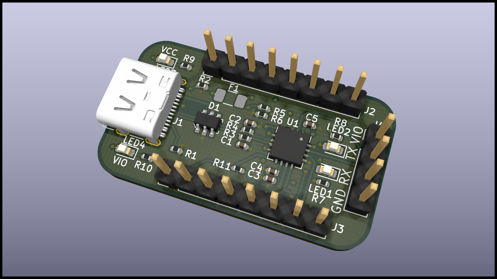
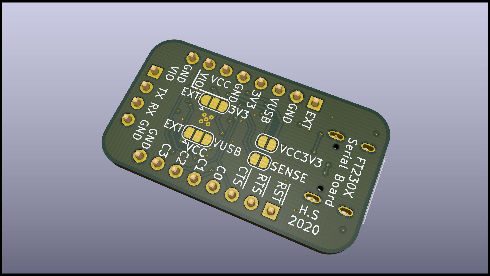

# FT230X Serial Board
This is a small board for breaking out the pins of the FT230X with a USB-C connector.
It was designed in KiCad version 5.1.6 on macOS 10.15 Catalina and the full project is available on the GitHub repository.

- [GitHub repository <i class="fa fa-external-link"></i>](https://github.com/hampussandberg/esp-boards/tree/master/FT230X-Serial-Board)
- [Interactive BOM](FT230X-Serial-Board-ibom.html){target="\_blank"}, created using [InteractiveHtmlBom <i class="fa fa-external-link"></i>](https://github.com/openscopeproject/InteractiveHtmlBom)

[{style="width:100%"}](3d-top.png)
[{style="width:100%"}](3d-bottom.png)

## Features
- USB-C connector with ESD protection chip
- Polyfuse on VUSB power rail
- 2.54 mm spaced headers for breadboard compatibility
- All pins of FT230X available on the headers
- Jumpers on the bottom of the board to select between different voltages and self vs bus powered mode
- LEDs for VCC and VIO
- LEDs for TX and RX activity (must program the FT230X CBUS pins for these LEDs to work)
- 4 layer board (can be redesigned for 2 layers, but due to the small size the price difference is negligible)

## Main components used
- [FT230X <i class="fa fa-external-link"></i>](https://www.ftdichip.com/Support/Documents/DataSheets/ICs/DS_FT230X.pdf) USB to BASIC UART IC
- [IP4234CZ6 <i class="fa fa-external-link"></i>](https://assets.nexperia.com/documents/data-sheet/IP4234CZ6.pdf) USB 2.0 ESD protection
