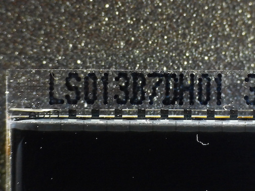
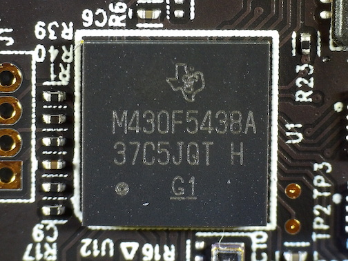
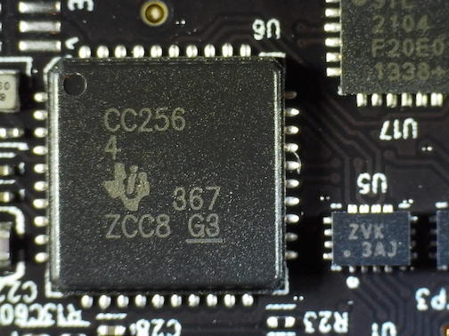
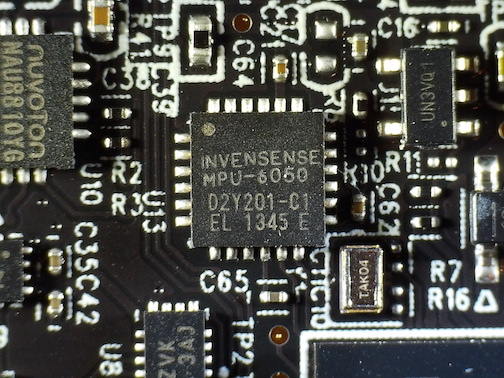
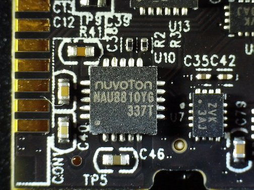
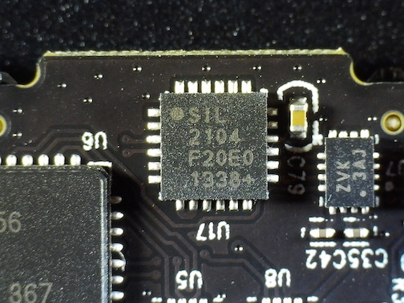

# Kreyos Smart Watch
Back in June, 2013, the smartwatch market was just about to take off and a company called Kreyos had just launched a [crowdfunding campaing on Indiegogo](https://www.indiegogo.com/projects/kreyos-the-only-smartwatch-with-voice-gesture-control) titled **"KREYOS: The ONLY Smartwatch With Voice & Gesture Control"**.
This was before the [Samsung Galaxy Gear](https://en.wikipedia.org/wiki/Samsung_Galaxy_Gear) (September, 2013) and the [Apple Watch](https://en.wikipedia.org/wiki/Apple_Watch) (April, 2015) launched.

## My experience
As eager as I was for a smartwatch, I contributed $125 to the campaign for the "EARLY ADOPTERS SPECIAL #2" perk which included one watch and a wristband and then the wait started...
In August, 2014 I got an email with a tracking number for two packages that were coming my way.
After the packages had went trough customs I got a bill for the import tax which I had to pay before I could collect the packages.
Since Kreyos decided to send two packages instead of one I had to pay a customs administrations fee twice and on top of that, they had declared a higher value on the package (probably their expected sales price of the product later).
As I had waited for a long time for this, I just payed the extra fees and tried to contact Kreyos to get a refund, but that of course did not amount to anything...

The user experience of the watch was never any good and it did not fit very well on my wrist so it quickly ended up in a box and forgotten...
On the [wikipedia page](https://en.wikipedia.org/wiki/Kreyos) the full timeline of this failed smartwatch is layed out and the criticism.
Before I threw mine away for good I did a quick teardown and took some photos.

## Hardware

| Item | Part number | Photo |
|:---:|---|---|
| Display | Sharp Microelectronics: LS013B7DH01 | [{style="width:50%"}](display-ls013b7dh01.jpeg) |
| MCU | Texas Instruments: M430F5438 | [{style="width:50%"}](mcu-m430f5438.jpeg) |
| Bluetooth | Texas Instruments: CC2564 | [{style="width:50%"}](bluetooth-CC2564.jpeg) |
| ANT RF | Texas Instruments: CC2570 | [{style="width:50%"}](ant-rf-cc2570.jpeg) |
| Accelerometer | TDK InvenSense: MPU-6050 | [{style="width:50%"}](acc-mpu-6050.jpeg) |
| Audio Codec | Nuvoton: NAU8810YG | [{style="width:50%"}](audio-nau8810.jpeg) |
| USB UART | Silicon Labs: CP2104 | [{style="width:50%"}](usb-uart-cp2104.jpeg) |

## Custom firmware
There seems to have been some attempts to run custom firmware on the watch ([KreyosMeteorite](https://github.com/KreyosMeteorite)), but no new commits have been pushed since September, 2017.

## Conclusion
Now in 2020 when there is an abundance of Android and Apple smartwatches available it seems that the market is at its peak.
Kreyos was probably too early and did not have the right knowledge and resources to pull it off, especially since both Samsung and Apple released their watches shortly after.
As for my Kreyos watch, I will probably desolder some of the components that might be useful to have and then put the rest in the electronic waste bin.
