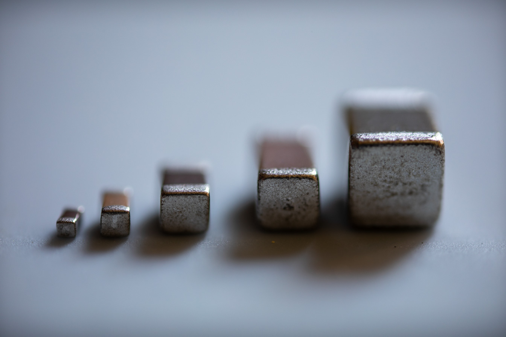
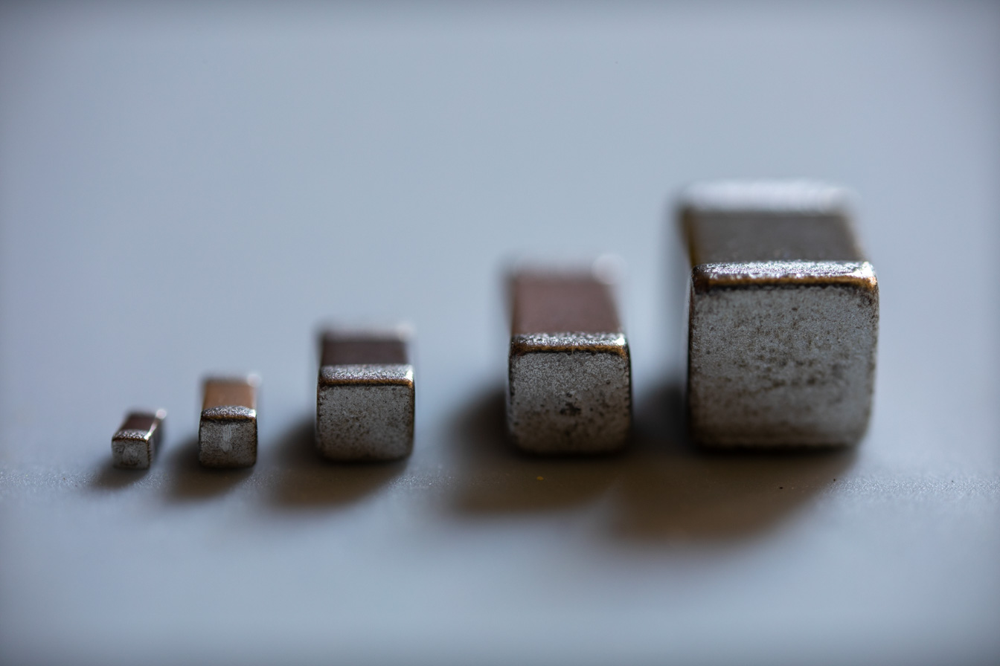
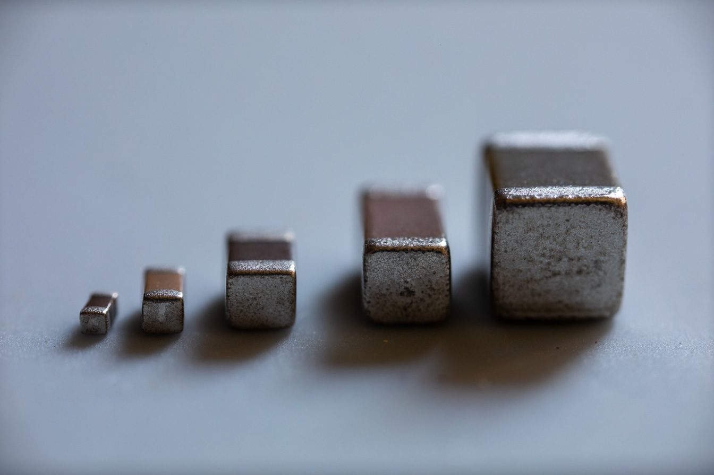
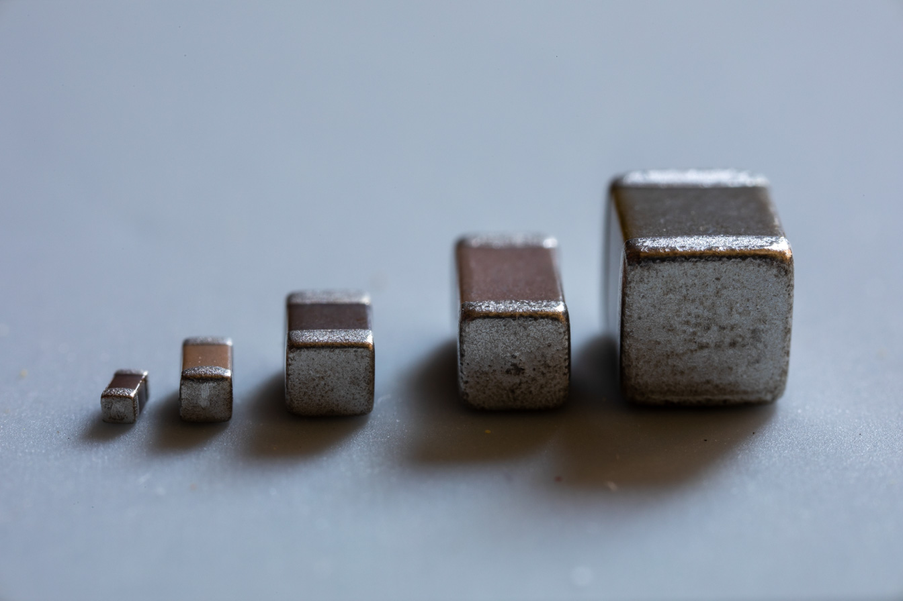
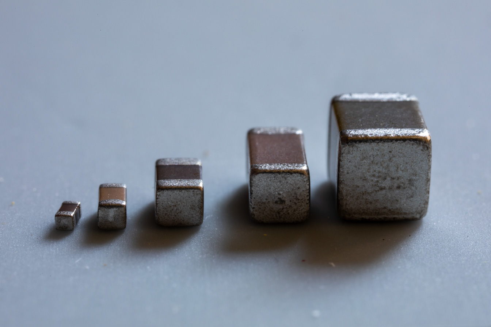
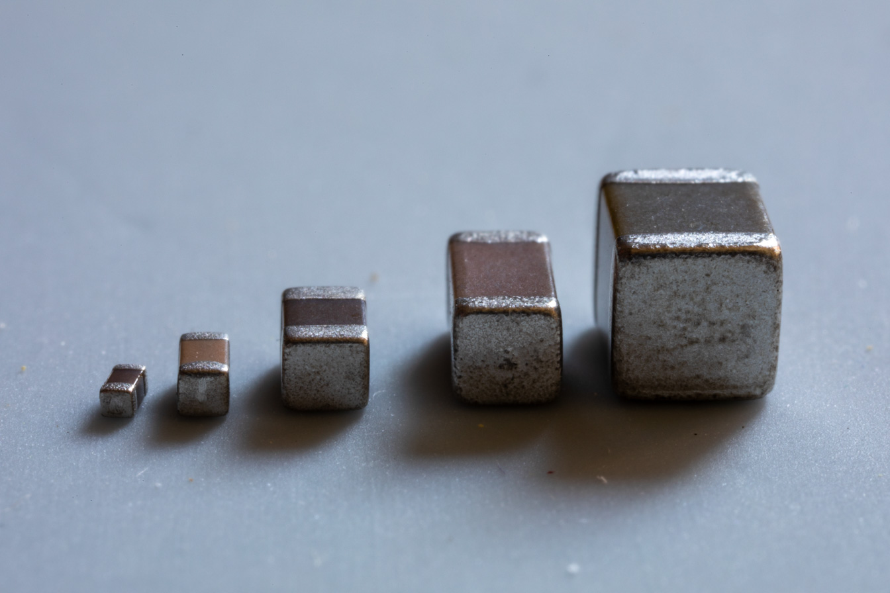

# Laowa 25mm f/2.8 2.5-5X Ultra Macro
TODO

## Apertures
Photo is of 5 surface mount capacitors of sizes 0402, 0603, 0805, 1206 and 1210.

| Aperture | Photo |
|:---:|---|
| f/2.8 | [{style="width:50%"}](laowa-25mm-f2.8.jpg) |
| f/4 | [{style="width:50%"}](laowa-25mm-f4.jpg) |
| f/5.6 | [{style="width:50%"}](laowa-25mm-f5.6.jpg) |
| f/8 | [{style="width:50%"}](laowa-25mm-f8.jpg) |
| ~f/10 | [{style="width:50%"}](laowa-25mm-f10-ish.jpg) |
| f/16 | [{style="width:50%"}](laowa-25mm-f16.jpg) |
| ~f/20 | [{style="width:50%"}](laowa-25mm-f20-ish.jpg) |

