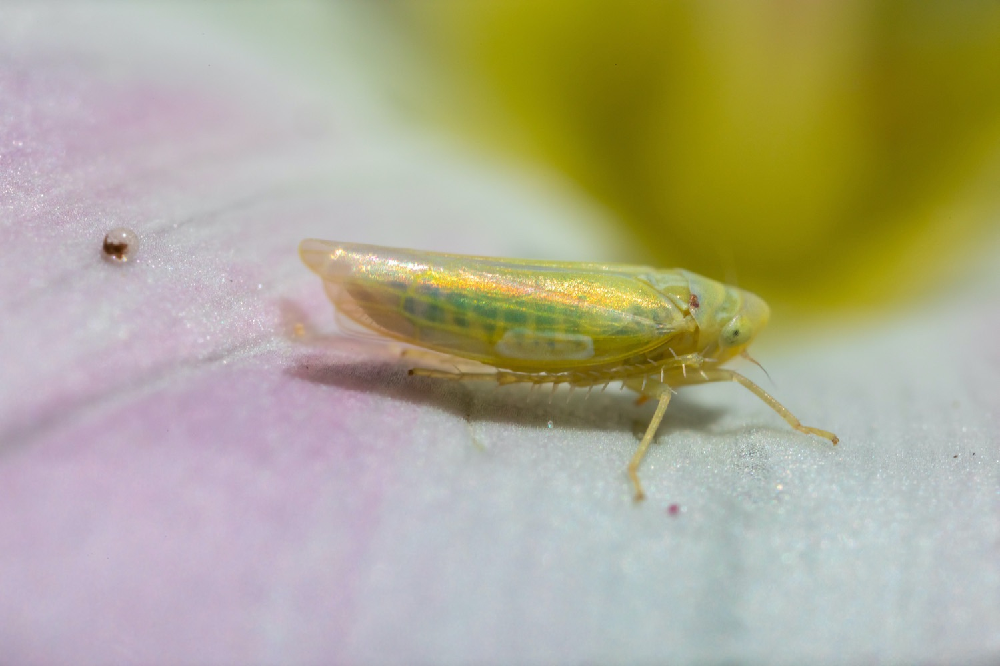
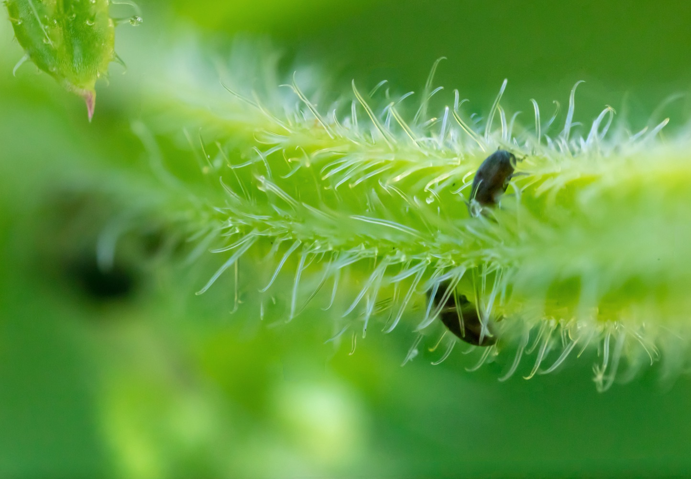
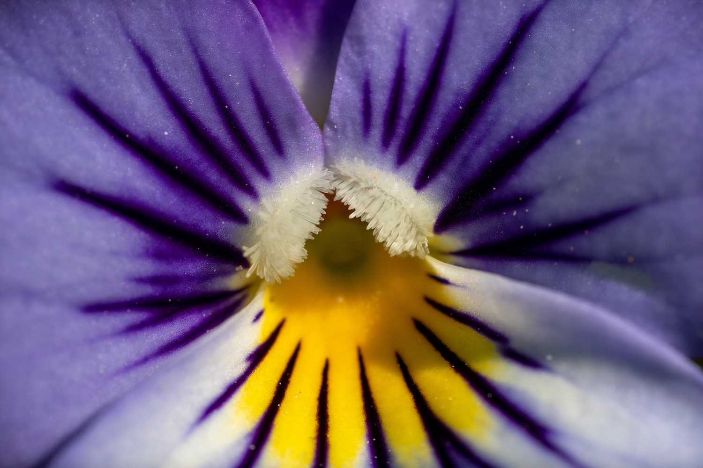
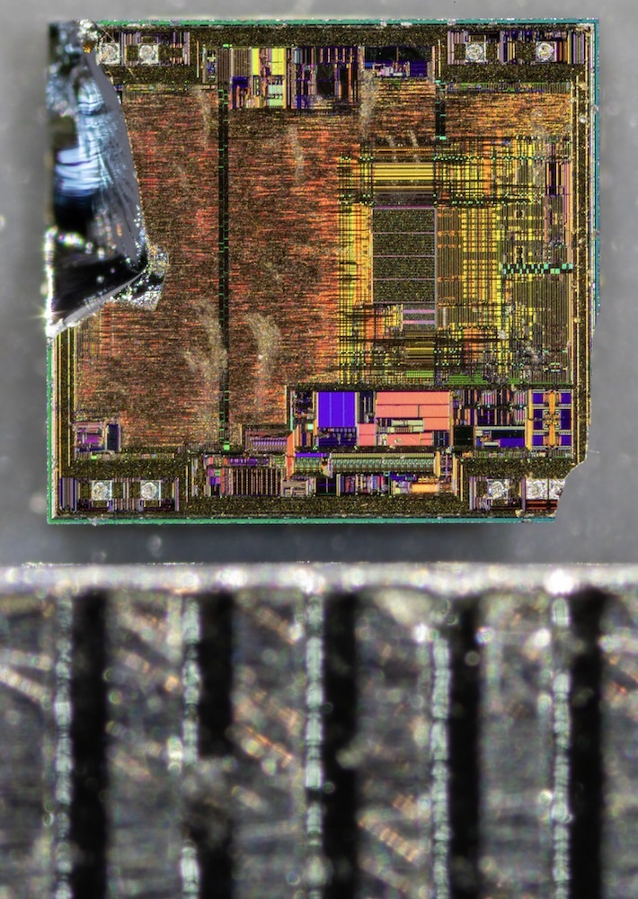

# Laowa 25mm f/2.8 2.5-5X Ultra Macro
TODO

## Example Photos

| Description | Photo |
|:---:|---|
| Yellow leafhopper. | [{style="width:50%"}](yellow-leafhopper.jpg) |
| Aphids on a plant. Handheld focus stack. | [{style="width:50%"}](aphid-stack.jpg) |
| Violet pansy flower. | [{style="width:50%"}](violet-pansy.jpg) |
| ATtiny45 chip die. Black lines on the ruler are 0.5 mm apart. | [{style="width:50%"}](attiny45.jpg) |

## Apertures
Photo is of 5 surface mount capacitors of sizes 0402, 0603, 0805, 1206 and 1210.

| Aperture | Photo |
|:---:|---|
| f/2.8 | [{style="width:50%"}](laowa-25mm-f2.8.jpg) |
| f/4 | [{style="width:50%"}](laowa-25mm-f4.jpg) |
| f/5.6 | [{style="width:50%"}](laowa-25mm-f5.6.jpg) |
| f/8 | [{style="width:50%"}](laowa-25mm-f8.jpg) |
| ~f/10 | [{style="width:50%"}](laowa-25mm-f10-ish.jpg) |
| f/16 | [{style="width:50%"}](laowa-25mm-f16.jpg) |
| ~f/20 | [{style="width:50%"}](laowa-25mm-f20-ish.jpg) |

